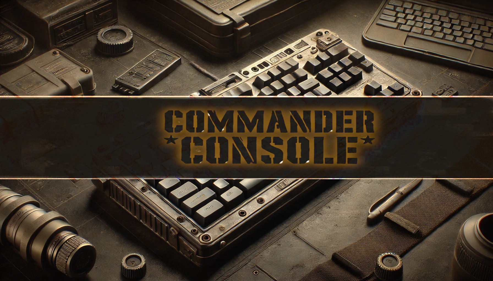

# Commander Console

<p align="center">
    
</p>

A personal training tool for improving real time strategy gameplay, built with the MERN stack (MongoDB, Express.js, React, Node.js), TypeScript, and Tailwind CSS.

## Tech Stack

- **Frontend:**

  - React with TypeScript
  - Tailwind CSS for styling
  - Vite for build tooling

- **Backend:**

  - Node.js with Express
  - TypeScript
  - MongoDB with Mongoose

- **Development Tools:**
  - Docker & Docker Compose
  - ESLint & Prettier
  - Git for version control

## Development

### Prerequisites

- Docker and Docker Compose
- Node.js (for local development)
- Git

### Getting Started

1. Clone the repository
2. Run with Docker:

   ```bash
   docker-compose up
   ```

3. For local development:

   ```bash
   # Frontend
   cd client
   npm install
   npm run dev

   # Backend
   cd server
   npm install
   npm run dev
   ```

## License

MIT License

Copyright (c) 2024 GameTrainer

Permission is hereby granted, free of charge, to any person obtaining a copy
of this software and associated documentation files (the "Software"), to deal
in the Software without restriction, including without limitation the rights
to use, copy, modify, merge, publish, distribute, sublicense, and/or sell
copies of the Software, and to permit persons to whom the Software is
furnished to do so, subject to the following conditions:

The above copyright notice and this permission notice shall be included in all
copies or substantial portions of the Software.

THE SOFTWARE IS PROVIDED "AS IS", WITHOUT WARRANTY OF ANY KIND, EXPRESS OR
IMPLIED, INCLUDING BUT NOT LIMITED TO THE WARRANTIES OF MERCHANTABILITY,
FITNESS FOR A PARTICULAR PURPOSE AND NONINFRINGEMENT. IN NO EVENT SHALL THE
AUTHORS OR COPYRIGHT HOLDERS BE LIABLE FOR ANY CLAIM, DAMAGES OR OTHER
LIABILITY, WHETHER IN AN ACTION OF CONTRACT, TORT OR OTHERWISE, ARISING FROM,
OUT OF OR IN CONNECTION WITH THE SOFTWARE OR THE USE OR OTHER DEALINGS IN THE
SOFTWARE.
